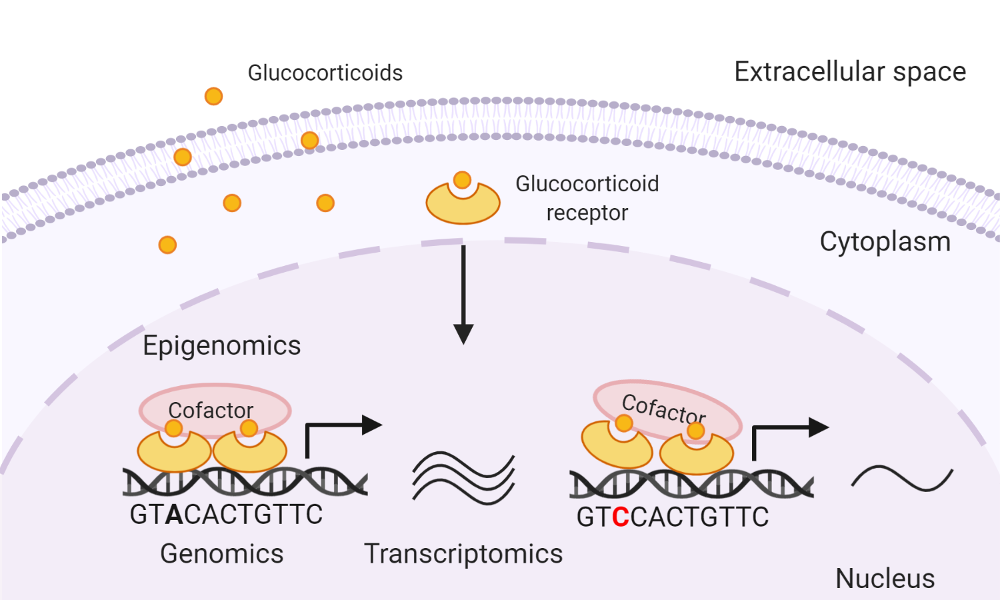
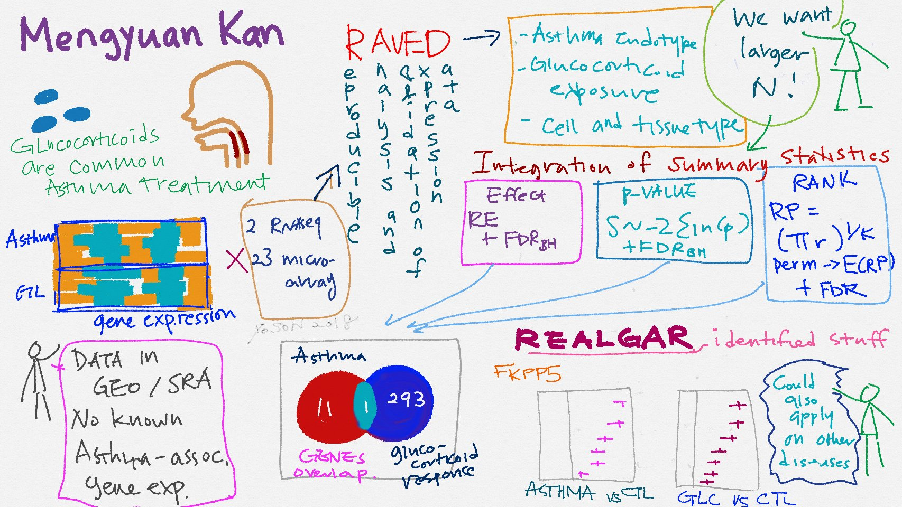

### Multiomics Integration to Identify Novel Disease Mechanisms

Omics approaches have advanced our [understanding](https://pubmed.ncbi.nlm.nih.gov/28774304/) of complex respiratory diseases. However, our ability to generate omics data far exceeds our ability to interpret and validate findings that are biologically informed. Most omics studies characterize biological information from single modalities. Integrative analysis of multiomics data provides insights into disease mechanisms beyond those from single-layered omics data.

We used an asthma-related phenotype, glucocorticoid response, as a study model. [Glucocorticoids](https://pubmed.ncbi.nlm.nih.gov/32910934/), commonly used drugs for the treatment of asthma, are known to exert anti-inflammatory effects via binding to glucocorticoid receptors (GRs), a type of transcription factors, and modulating gene transcription. Some asthma patients respond pooly to glucocorticoids, in part due to genetic differences. Yet genome-wide association studies (GWAS) of glucocorticoid response did not find reproducible genetic associations that reach genome-wide levels of statistical significance.

Our previous transcriptomic integration study [identified](https://pubmed.ncbi.nlm.nih.gov/30694689/) tissue-specific gene expression signature of glucocorticoid response. To leverage norminal genetic associations, we developed [multiomics integrative scores](https://pubmed.ncbi.nlm.nih.gov/34971648/) to rank these variants based on their functional annotations inferred from transcripotmic, ChIP-Seq, DNA motif, and eQTL data. This enabled us identify variants near the gene *BIRC3* as a novel genetic locus that might influence patients' response to glucocorticoids via modulation of GR signaling in airway cells.

This multiomics integrative score can be extended to prioritize norminal genetic associations for other complex phenotypes for further mechanistic studies.

---

### Leverage Public Omics Datasets to Test Novel Hypotheses

With the advent of high throughput omics technologies, the volume of publicly available omics data has increased ever since. These data include experiments that compared disease versus healthy individuals as well as cells exposed to drugs versus vehicle control. Leveraging existing datasets offers experimental researchers a cost-effective avenue to test their novel hypotheses on disease mechanisms. Although these datasets are valuable, in their raw form, they are not helpful to experimental researchers who lack adequate computational resources or experience analyzing omics data.

To facilitate the reproducible analysis of publicly available omics data, we developed pipelines [RAVED](https://github.com/HimesGroup/raved) for transcriptomic data analysis and [brocade](https://github.com/HimesGroup/brocade) for ChIP-Seq data analysis, and and an web app [REALGAR](http://realgar.org/) that integrates analysis-ready omics data and allows end-users to visualize integrated results on-the-fly.

These open-source tools enabled identification of tissue-specific [differentially expressed genes](https://pubmed.ncbi.nlm.nih.gov/30815178/) and [differential transcription factor binding sites](https://pubmed.ncbi.nlm.nih.gov/32308830/) related to asthma and drug response, and 
prioritization of [asthma-associated variants](https://pubmed.ncbi.nlm.nih.gov/35863045/) that might contribute to asthma via their influence on glucocorticoid receptor-modulated glucocorticoid response. Here is a nice illustration by [Yoson](https://twitter.com/__yoson__) when I presented *RAVED* in IBI retreat.

I collaborate with molecular biologists to analyze and interpret their omics data using these open-source tools and pipelines and have made significant [scientific discoveries](https://www.pennmedicine.org/news/news-releases/2020/july/self-eating-process-of-stem-cells-may-be-the-key-to-new-regenerative-therapies).
